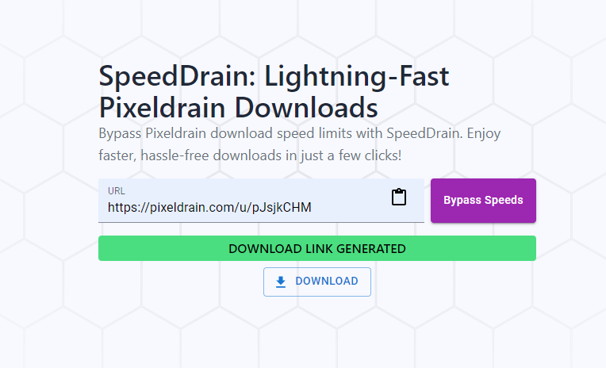

# <h1>[SpeedDrain](https://speeddrain.vercel.app/): Lightning-Fast Pixeldrain Downloads</h1>

## 🚀 What is SpeedDrain?

SpeedDrain is a powerful and easy-to-use tool designed to bypass Pixeldrain's slow download speeds. With just a few clicks, you can download files faster and more efficiently, saving time and frustration.

### 🔥 Features
- **Blazing-Fast Downloads**: Remove speed limits and download files quickly.
- **User-Friendly Interface**: Simple and intuitive design for hassle-free use.
- **Secure & Reliable**: Enjoy safe and uninterrupted downloads.
- **No Sign-Ups Required**: Start downloading instantly without registration.
- **Completely Free**: 100% free to use with no hidden costs.

## 🌟 Why Choose SpeedDrain?

If you're tired of slow Pixeldrain downloads, SpeedDrain is the perfect solution. It enhances your downloading experience by offering a seamless, high-speed alternative to Pixeldrain’s limitations.

## 📌 How to Use SpeedDrain?
1. **Visit [SpeedDrain](https://speeddrain.vercel.app/).**
2. **Paste the Pixeldrain file link** you want to download.
3. **Click on the download button.**
4. **Enjoy faster downloads** without any restrictions!

## 🔗 Try SpeedDrain Now

[✨ Get Started with SpeedDrain](https://speeddrain.vercel.app/)

---

### 🏷 Keywords (SEO Optimized)
- Fast Pixeldrain Downloader
- Speed up Pixeldrain downloads
- Download Pixeldrain files quickly
- Free Pixeldrain downloader tool
- Bypass Pixeldrain speed limits
- High-speed file downloader

Upgrade your download experience today with SpeedDrain! 🚀

